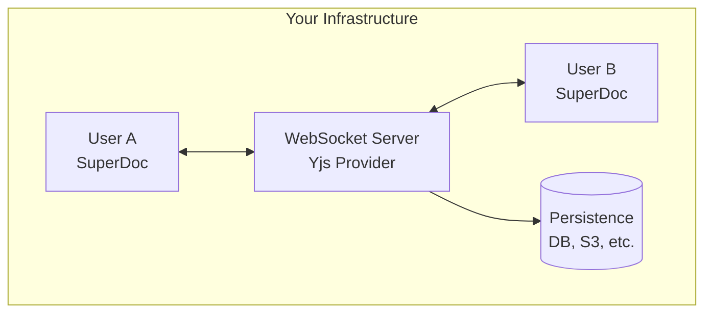

Run your own collaboration infrastructure for full control over data, persistence, and scaling.

## Why self-host?

<CardGroup cols={2}>
  <Card title="Data Control" icon="lock">
    Keep all data on your infrastructure
  </Card>
  <Card title="Custom Persistence" icon="database">
    Use your own database (PostgreSQL, S3, Redis)
  </Card>
  <Card title="On-Premise" icon="building">
    Deploy behind your firewall
  </Card>
  <Card title="No Vendor Lock-in" icon="lock-open">
    Standard Yjs protocol, portable data
  </Card>
</CardGroup>

## Architecture



## Choose your approach

SuperDoc's integration contract is provider-agnostic: pass `{ ydoc, provider }` to `modules.collaboration` and the server choice is yours. Any Yjs-compatible server works.

| Option | Notes | Setup Time |
|--------|-------|------------|
| [YHub](/guides/collaboration/yhub) | Advanced Yjs backend for attribution, activity, and revision-history workflows. Beta; validate licensing and infrastructure requirements. | 1+ hour |
| [Hocuspocus](/guides/collaboration/hocuspocus) | Mature self-hosted Yjs server with auth, persistence, and scaling hooks. | 30 mins |
| [SuperDoc Yjs](/guides/collaboration/superdoc-yjs) | Minimal reference server for prototypes and local development. Not production infrastructure. | 30 mins |

## At a glance

<Tabs>
  <Tab title="YHub">
    Advanced Yjs backend for attribution, activity, and revision-history workflows. Redis + Postgres backing. Beta; validate licensing and infrastructure requirements.

    [Setup guide](/guides/collaboration/yhub)
  </Tab>

  <Tab title="Hocuspocus">
    Mature self-hosted Yjs server with auth, persistence, and scaling hooks.

    ```bash
    npm install @hocuspocus/server @hocuspocus/provider
    ```

    [Setup guide](/guides/collaboration/hocuspocus)
  </Tab>

  <Tab title="SuperDoc Yjs">
    A small Yjs WebSocket server we ship for prototypes and local development. Not production infrastructure: no built-in auth, persistence, scaling, or observability.

    ```bash
    npm install @superdoc-dev/superdoc-yjs-collaboration
    ```

    [Reference](/guides/collaboration/superdoc-yjs)
  </Tab>

  </Tabs>

## Client connection options

The supported contract is provider-agnostic: you create the Yjs provider, SuperDoc plugs into it.

### Provider-agnostic (recommended)

```javascript
import { HocuspocusProvider } from '@hocuspocus/provider';
import * as Y from 'yjs';

const ydoc = new Y.Doc();
const provider = new HocuspocusProvider({
  url: 'wss://your-server.com',
  name: 'document-123',
  document: ydoc
});

new SuperDoc({
  selector: '#editor',
  modules: {
    collaboration: { ydoc, provider }
  }
});
```

This shape works with any Yjs provider: `HocuspocusProvider`, `WebsocketProvider` from `y-websocket` (compatible with YHub and SuperDoc Yjs), `LiveblocksYjsProvider`, or your own.

### URL-based (deprecated)

<Warning>
This path is deprecated. SuperDoc creates the provider internally and emits a console warning. Use the provider-agnostic shape above for new code.
</Warning>

```javascript
new SuperDoc({
  selector: '#editor',
  modules: {
    collaboration: {
      url: 'wss://your-server.com/doc',
      token: 'auth-token'
    }
  }
});
```

## Requirements

### Server

- Node.js 18+
- WebSocket support (native or via library)
- Persistent storage for documents

### Network

- WSS (WebSocket Secure) in production
- Proper CORS configuration
- Load balancer with sticky sessions (if scaling)

## Next steps

<CardGroup cols={2}>
  <Card
    title="YHub setup"
    icon="layers"
    href="/guides/collaboration/yhub"
  >
    Attribution and revision-history workflows (beta)
  </Card>

  <Card
    title="Hocuspocus setup"
    icon="server"
    href="/guides/collaboration/hocuspocus"
  >
    Mature self-hosted Yjs server
  </Card>

  <Card
    title="SuperDoc Yjs reference"
    icon="flask-conical"
    href="/guides/collaboration/superdoc-yjs"
  >
    Minimal server for prototypes and local development
  </Card>

  <Card
    title="Configuration"
    icon="settings"
    href="/editor/collaboration/configuration"
  >
    All client-side options and events
  </Card>
</CardGroup>
